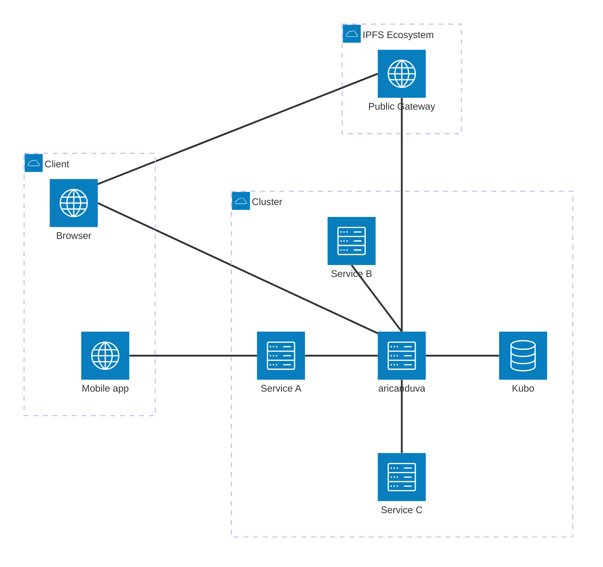
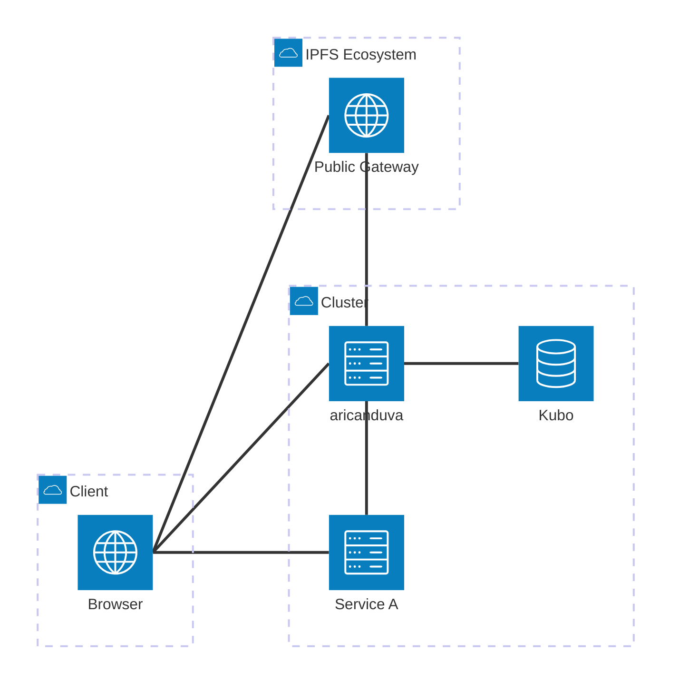
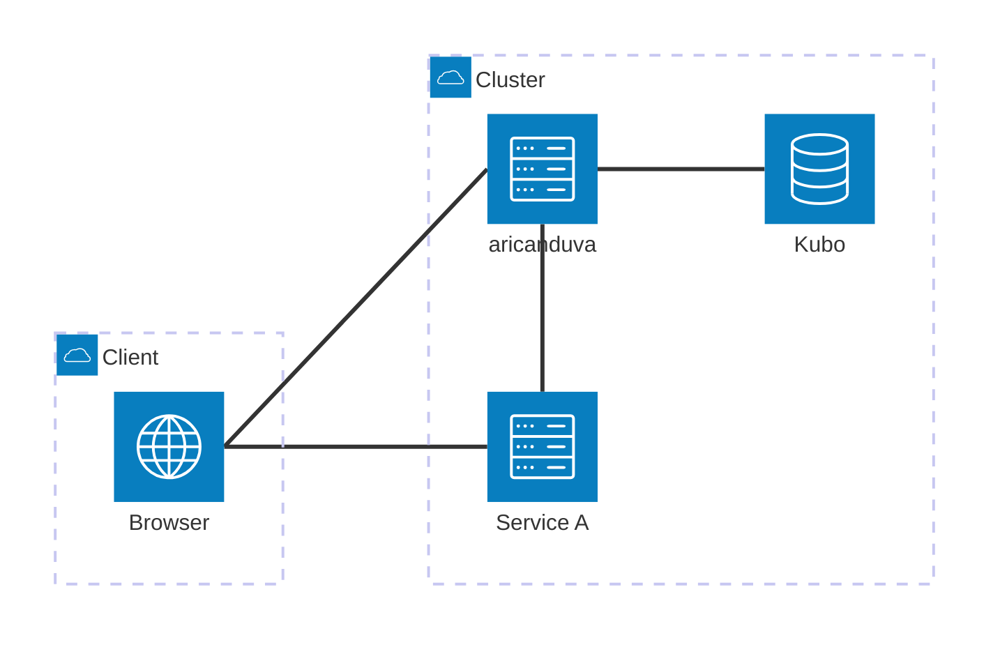

# aricanduva

Simple S3 endpoint API that proxy requests to an [IPFS](https://ipfs.tech/) node.

This service allows projects which requires S3-like endpoints to read and write files, without requiring porting their code to work IPFS.
Useful on a homelab scenario, where you'd like to integrate with off-the-shelf services, but store and distribute files over your IPFS node. Examples: `gotosocial` profile pictures.

It's called `aricanduva` is a reference to the `Ponte Aricanduva` in Sao Paulo, Brasil - because this is a `bridge` between S3 and IPFS.

## Running it

<a href="https://hub.docker.com/r/bltavares/aricanduva">
  
</a>
<a href="https://github.com/bltavares/aricanduva/pkgs/container/aricanduva">
  
</a>
<a href="https://github.com/bltavares/aricanduva/releases/tag/latest">

</a>

Docker images available in [GHCR](https://github.com/bltavares/aricanduva/pkgs/container/aricanduva) and [Docker Hub](https://hub.docker.com/r/bltavares/aricanduva). 

If you are running Kubo on a container, you can use the `host-gateway` to access it, or any other connectivity means, such as `docker compose` with `links:`, container orchestration service discovery, etc.

```sh
docker run \
   --add-host host.docker.internal:host-gateway
   -e RPC_ADDRESS=http://host.docker.internal:5001/api/v0 \
   bltavares/aricanduva
```

Binaries are also provided for Windows, Mac and Linux as [Github Releases](https://github.com/bltavares/aricanduva/releases/tag/latest).

## Project Overview

The project is designed to be used specifically on a self-hosted scenario. To make it portable, there are a few designs take:

- Containerized runtime
- Configuration using env-vars or CLI arguments
- Lightweight runtime (`Rust`)
- Streaming responses when possible (`async`)
- Low operational requirements (`SQlite`)
- Logs for troubleshooting (`export RUST_LOG=debug`)
- Portable coding practices targeting Linux, Mac and Windows
- Healthcheck endpoint for container orchestrators (`/healthz`)

In order to run this proxy, you must provide a IPFS Node RPC connection address, as this project does not run itself a IPFS Node. You most likely want to use a [Kubo container](https://docs.ipfs.tech/install/run-ipfs-inside-docker/).

>[!TIP]
> Ensure Kubo address is accessible to `aricanduva`, either by binding to all address + Basic password, or using the startup script to listen to private networks only

As long `aricanduva` can talk to an IPFS Node, it should work, either on the same machine or in a clustered scenario.

By default, it will run with `mode: auto`, using an [experimental and non-standard S3-API mode](#auto-mode-redirect-publicly-and-proxy-locally), which allows `aricanduva` to be exposed to the internet without generating too much traffic - important in a homelab scenario.

> [!IMPORTANT]
> If exposing `aricanduva` to the internet, ensure it's using a reverse proxy for HTTPS/SSL as well as running with `auth` enabled, otherwhise anonymous users may add files to your IPFS Node. 
>
> Exaple flags: `--ip-extraction=RightmostXForwardedFor  --auth-access-key=banana --auth-secret-key=bananabanana --mode auto`


## IPFS ecosystem integration

The service supports the `x-ipfs-path` header in responses, which provides the full IPFS path for retrieved objects. This allow [IPFS Companion](https://github.com/ipfs-shipyard/ipfs-companion) to intercept requests and use your preferred gateway and IPFS node.

- **`x-ipfs-path`**: Contains the IPFS path (e.g., `/ipfs/<CID>`) for the object.
- **`x-ipfs-roots`**: Contains the CID of the object.


The project uses file streaming to return content in `mode: proxy` which allow users with the `IPFS Companion` plugin in browser to abort the request without causing too much memory/data transfer on the proxy.****


## Supported operations

- AWS SigV4 authorization
  - :warning: Not performing payload signature checks
  - Single chunk payload [ref](https://docs.aws.amazon.com/AmazonS3/latest/API/sig-v4-header-based-auth.html)
  - Multiple chunk file [ref](https://docs.aws.amazon.com/AmazonS3/latest/API/sigv4-streaming.html)
  - Query paramenter (Used in `PreSignedUrl`) [ref](https://docs.aws.amazon.com/AmazonS3/latest/API/sigv4-query-string-auth.html)
- Bucket
  - [HeadBucket](https://docs.aws.amazon.com/AmazonS3/latest/API/API_HeadBucket.html)
  - [GetBucket](https://docs.aws.amazon.com/AmazonS3/latest/API/API_control_GetBucket.html)
  - [GetBucketLocation](https://docs.aws.amazon.com/AmazonS3/latest/API/API_GetBucketLocation.html)
  - [DeleteObjects](https://docs.aws.amazon.com/AmazonS3/latest/API/API_DeleteObjects.html)
- Object
  - [GetObject](https://docs.aws.amazon.com/AmazonS3/latest/API/API_GetObject.html)
  - [HeadObject](https://docs.aws.amazon.com/AmazonS3/latest/API/API_HeadObject.html)
  - [PutObject](https://docs.aws.amazon.com/AmazonS3/latest/API/API_PutObject.html)
  - [DeleteObject](https://docs.aws.amazon.com/AmazonS3/latest/API/API_DeleteObject.html)
- MultiPartUpload
  - [CreateMultiPartUpload](https://docs.aws.amazon.com/AmazonS3/latest/API/API_CreateMultipartUpload.html)
  - [UploadPart](https://docs.aws.amazon.com/AmazonS3/latest/API/API_UploadPart.html)
  - [AbortMultiPartUpload](https://docs.aws.amazon.com/AmazonS3/latest/API/API_AbortMultipartUpload.html)
  - [CompleteMultiPartUpload](https://docs.aws.amazon.com/AmazonS3/latest/API/API_CompleteMultipartUpload.html)


## Architecture

`aricanduva` works exposing AWS S3 endpoints for services and customers, allowing then to interact with a IPFS Node (such as `kubo`) as if it was talking with AWS S3.

This means that any service in a cluster that allows configuring AWS S3 integration can point to `aricanduva` to read and store files in IPFS.

This allows a single bridge service to offer IPFS storage for many services at once.



### Experimental

#### Auto mode: Redirect publicly and proxy locally

Considering this project is designed to run on a homelab, ensuring resource utilization is low is very important, specially as bandwidth might be limited by the ISP.

For this scenario, `aricanduva` has an `mode: auto` with a non-standard `GetObject` redirect to a [IPFS Public Gateway](https://dweb.link).

This mode has two scenarios:
  - When the request comes from an IP on a Private Network range, it will return the content directly
  - When the request comes from an IP on a Public Network range, it will return a `307 Temporary Redirect` to the configured public gateway address that would actually return the content

> [!IMPORTANT]  
> A `307 Redirect` is a non-standard response from the S3 API and many clients/SDKs will not follow the redirect, causing errors on services. This works as expected on browsers tho.


This is useful on the following scenario:

  - A service uses `aricanduva` to store files using the S3 API, such a profile pictures
  - The service also have a Web interface to render the files, using `PreSignedUrl` pointing to `aricanduva`
  - The client connects to the `service` and see the `PreSignedUrl`
  - When retrieving, it fetchs the content from the Public Gateway instead of the `aricanduva` instance

This means `aricanduva` can be exposed to the internet together with the service, provide a compatible S3 API to the service, while still serving content (in non-standard protocol) for broswers and other clients that follow redirects.

Considering services will return the content directly from `aricanduva` as they are on the private network range, it will not break compatibility with SDKs and clients.



If you deploy a [Split-horizon DNS](https://en.wikipedia.org/wiki/Split-horizon_DNS) resolution on your network, you can optmize file transfer paths.

Alternatively, you can run with `--mode=proxy` to serve the content directly from `aricanduva` and always run in a standard mode.




> [!NOTE]
> There is `--mode redirect` but it's mostly for testing it returns `307 Redirect` always and this breaks most S3 SDK and clients that don't follow redirects

#### Trimming empty dirs from MFS

When a file is removed, `aricanduva` will try to trim empty folders from the MFS layer on the IPFS Node, to ensure it's kept tidy.

At this moment, due to some limitations on the feature-set of SQLite, this will generate a `N+1 queries`, for each path segment. This means a deeply-nested key entry might take a while to be cleanup and may tax the database.

> [!NOTE]
> If possible, avoid using deeply nested keys

If you'd like to avoid trimming if deeply nested keys are used by services, disable it with `--experimental-trim-empty-folders=false`

#### Auto Mime detection

`aricanduva` stores the `Content-Type:` header on `PutObject` operations, but some clients might not send this information on the request.

If there is no `content-type` header, the service will attempt to guess it based on the file extension.

Disable `content-type` guessin with `--expreimenta-auto-mime=false`


### MultiPartUpload

`MultiPartUpload` was a required feature to implement even for small files, based on testing with a few SDK and S3-client. Ideally, when the size is know, it should use a single `PUT PutObject` request, yet many of them will perform a more complicated multi-call using the `POST MultiPartUpload` implementation

> [!IMPORTANT]  
> The implemtation is naive and stores files in-memory. If the service restarts mid-upload, the client must try again. 
> 
> This also means large files using `MultiPartUpload` will require lots of memory of the process.


In order to get it done quickly, `MultiPartUpload` stages parts in-memory, and collate all parts on `CompleteMultiPartUpload` call. It will only store content on IPFS and the metadata database when completed.

If you expect large files, run with high memory limits, to avoid restarts mid-upload and loosing data.

## Local Development

The project declares integration with [cargo-run-bin](https://crates.io/crates/cargo-run-bin) to help setup environment.

### Hot-Reloading with systemfd

For development with hot-reloading, use `systemfd` to manage the socket:

```bash
make run
```

This setup allows the server to automatically reload when code changes are detected.

### Update database schemas

To test database queries, use `cargo sqlx` commands (from `sqlx-cli`).

```sh
make prepare
```

### Building locally

You can build on Docker, which uses [cargo-chef](https://github.com/LukeMathWalker/cargo-chef) to optimize layers. 

```sh
make docker DOCKER_IMAGE=example/aricanduva
```

## TODOs

Known issues and future work so I don't forget when I visit this project in the future

- [ ] Support GET RANGE and pass forward ipfs `cat_range`
- [ ] Refactor the `ipfs-api` crate to support `impl AsyncRead + !Send` as `axum::Body: !Send`
- [ ] Implement integrity check of validation of headers with hashing of the body in single chunk
- [ ] Implement integrity check of validation of headers with hashing of chunk reader


### Acknowledgements

- [prsutherland/depotd](https://github.com/prsutherland/depotd): To figure out AWS SigV4 + Axum integration
- [minio/minio-go](https://github.com/minio/minio-go), [minio/minio](https://github.com/minio/minio-go), and [minio/minio-rs](https://github.com/minio/minio-rs) to figure out which operations are required by services
- [RTradeLtd/s3x](https://github.com/RTradeLtd/s3x): previous work but deprecated